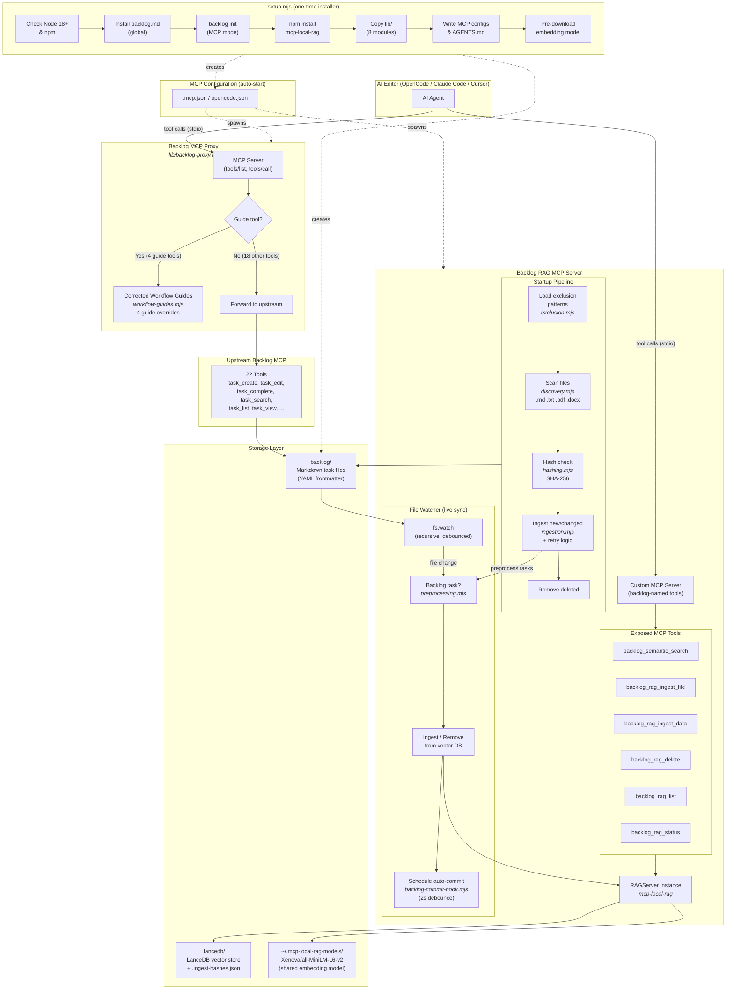

# MCP Setup & Flow

```mermaid
graph TB
    subgraph Editor["AI Editor (OpenCode / Claude Code / Cursor)"]
        Agent["AI Agent"]
    end

    subgraph MCP_Configs["MCP Configuration (auto-start)"]
        MCPJson[".mcp.json / opencode.json"]
    end

    subgraph Proxy["Backlog MCP Proxy<br/><i>lib/backlog-proxy.mjs</i> (stdio)"]
        direction TB
        ProxyServer["MCP Server<br/>(tools/list, tools/call)"]
        Interceptor{"Guide tool?"}
        CorrectedGuides["Corrected Workflow Guides<br/><i>workflow-guides.mjs</i><br/>4 guide overrides"]
        Forward["Forward to upstream"]
    end

    subgraph Upstream["Upstream Backlog MCP<br/><code>backlog mcp start</code>"]
        BacklogTools["22 Tools<br/>task_create, task_edit,<br/>task_complete, task_search,<br/>task_list, task_view, ..."]
    end

    subgraph RAG["Backlog RAG MCP Server<br/><i>lib/rag-server.mjs</i> (stdio)"]
        direction TB
        RAGMcp["Custom MCP Server<br/>(backlog-named tools)"]
        RAGInstance["RAGServer Instance<br/><i>mcp-local-rag</i>"]

        subgraph Tools["Exposed MCP Tools"]
            Search["backlog_semantic_search"]
            Ingest["backlog_rag_ingest_file"]
            IngestData["backlog_rag_ingest_data"]
            Delete["backlog_rag_delete"]
            List["backlog_rag_list"]
            Status["backlog_rag_status"]
        end

        subgraph Startup["Startup Pipeline"]
            direction LR
            S1["Load exclusion<br/>patterns<br/><i>exclusion.mjs</i>"]
            S2["Scan files<br/><i>discovery.mjs</i><br/>.md .txt .pdf .docx"]
            S3["Hash check<br/><i>hashing.mjs</i><br/>SHA-256"]
            S4["Ingest new/changed<br/><i>ingestion.mjs</i><br/>+ retry logic"]
            S5["Remove deleted"]
            S1 --> S2 --> S3 --> S4 --> S5
        end

        subgraph Watcher["File Watcher (live sync)"]
            FSWatch["fs.watch<br/>(recursive, debounced)"]
            PreProcess["Backlog task?<br/><i>preprocessing.mjs</i>"]
            IngestOrRemove["Ingest / Remove<br/>from vector DB"]
            AutoCommit["Schedule auto-commit<br/><i>backlog-commit-hook.mjs</i><br/>(2s debounce)"]
        end
    end

    subgraph Storage["Storage Layer"]
        BacklogDir["backlog/<br/>Markdown task files<br/>(YAML frontmatter)"]
        LanceDB[".lancedb/<br/>LanceDB vector store<br/>+ .ingest-hashes.json"]
        ModelCache["~/.mcp-local-rag-models/<br/>Xenova/all-MiniLM-L6-v2<br/>(shared embedding model)"]
    end

    subgraph SetupFlow["setup.mjs (one-time installer)"]
        direction LR
        I1["Check Node 18+<br/>& npm"]
        I2["Install backlog.md<br/>(global)"]
        I3["backlog init<br/>(MCP mode)"]
        I4["npm install<br/>mcp-local-rag"]
        I5["Copy lib/<br/>(8 modules)"]
        I6["Write MCP configs<br/>& AGENTS.md"]
        I7["Pre-download<br/>embedding model"]
        I1 --> I2 --> I3 --> I4 --> I5 --> I6 --> I7
    end

    %% Editor connections
    Agent -->|"tool calls (stdio)"| ProxyServer
    Agent -->|"tool calls (stdio)"| RAGMcp
    MCPJson -.->|"spawns"| Proxy
    MCPJson -.->|"spawns"| RAG

    %% Proxy flow
    ProxyServer --> Interceptor
    Interceptor -->|"Yes (4 guide tools)"| CorrectedGuides
    Interceptor -->|"No (18 other tools)"| Forward
    Forward --> BacklogTools

    %% RAG flow
    RAGMcp --> Tools
    Tools --> RAGInstance
    RAGInstance --> LanceDB
    RAGInstance --> ModelCache

    %% Startup
    Startup --> BacklogDir
    S4 -->|"preprocess tasks"| PreProcess

    %% Watcher flow
    FSWatch -->|"file change"| PreProcess
    PreProcess --> IngestOrRemove
    IngestOrRemove --> RAGInstance
    IngestOrRemove --> AutoCommit
    BacklogDir --> FSWatch

    %% Backlog tools -> files
    BacklogTools --> BacklogDir

    %% Setup
    SetupFlow -.->|"creates"| MCPJson
    SetupFlow -.->|"creates"| BacklogDir
```
